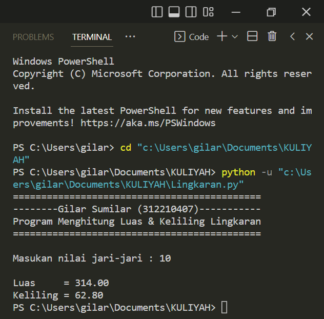

# Praktikum3

Penjelasan cara kerja codingan menghitung luas & keliling lingkaran

1. Tambahkan variabel jari-jari, input dalam bentuk float dan teks nya di isi dengan "Masukan nilai jari-jari"
   seperti gambar di atas.
   
2. Masukan rumus, masukan variable phi/3,14 dan buat variable diameter yg isi ny rumus diameter.

3. Buat opsi perhitungan 

   - Luas lingkaran = phi* r * r
   
   - Keliling lingkaran = phi * diameter
   
4. Tampilkan nilai luas & keliling nya "print('\nLuas =' str("%.2f" % luas))" untuk keliling sama "Luas" nya saja di ganti "keliling"
   - "%.2f" berfungsi untuk menampilkan angka di belakang "," sebanyak 2 angka contoh : "%.1f" = 90.2, "%.0f" = 90 saja
   
   - Dan fungsi \n untuk membuat jarak dengan syntax di bawah
   
   - Dan fungsi \t untuk membuat spasi
   
5. Hasil dari program di atas

